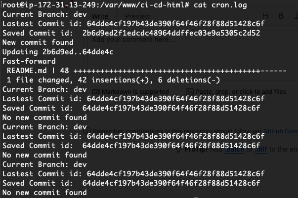

# GitHub Auto-Pull Script

This Python script simplifies keeping a local GitHub repository in sync with a remote branch. It automatically checks for and pulls new commits. There are 2 approches for this

- Python Script
- Bash Script

## Python Script
The script authenticates with GitHub, checks for new commits on a specified branch, and pulls the latest changes if any are found.  It uses a file to track the last checked commit.

### How to Use

- **Install:** `pip install pygithub python-dotenv gitpython`
- **.env File:** Create a `.env` file with your GitHub token (`GIT_TOKEN`) and branch name (`BRANCH`).  *Do not commit this file.*
- **Clone:** Clone the repository you want to update.
- **Run:** Place the script in the cloned directory and run it with `python your_script_name.py`.

### Prerequisites

* Python 3.x
* GitHub account
* Cloned repository

### Key Ideas

* **Automation:**  Keeps your local repo up-to-date.
* **Security:** Protect your GitHub token.
* **Simplicity:** Easy to set up and use.

--- 

## Bash Script
This bash script automates the process of checking for new commits on a specified Git branch and updating the local repository accordingly. It compares the latest commit hash from the remote repository with a locally stored hash, and if a new commit is detected, it performs a `git pull` to update the repository and saves the new commit hash in a tracking file.

### Features
- **Environment Variable Loading:** Sources a `.env` file to load the branch name.
- **Remote Commit Check:** Retrieves the latest commit hash from the remote repository for the specified branch.
- **Commit Comparison:** Compares the remote commit hash with the locally stored hash.
- **Automated Update:** Executes `git pull` to update the repository when a new commit is found.
- **Commit Tracking:** Updates a file (`latest_commit.txt`) with the new commit hash after pulling the changes.

### Prerequisites
- **Git:** Ensure Git is installed and configured on your system.
- **Bash:** This script requires a Unix-like environment with bash.
- **.env File:** A `.env` file in the repository root containing the `BRANCH` variable (e.g., `BRANCH=main`).

### Installation

1. **Clone the Repository:**  
   Clone the repository containing this script to your local machine.

2. **Create the `.env` File:**  
   In the repository root, create a `.env` file with the following content:
   ```ini
   BRANCH=your_branch_name
   ```
   Replace your_branch_name with the name of the branch you want to monitor (e.g., main or master).

3. **Make the Script Executable:**
   ``` chmod +x automate.sh ```

4. **Set Up cron tab:**
    ```* * * * * cd /var/www/ci-cd-html && ./automate.sh >> /var/www/ci-cd-html/cron.log```

### Output



### Key Ideas

* **Automation:**  Keeps your local repo up-to-date with CRONTAB trigger for every minute
* **Simplicity:** Easy to set up and use.

